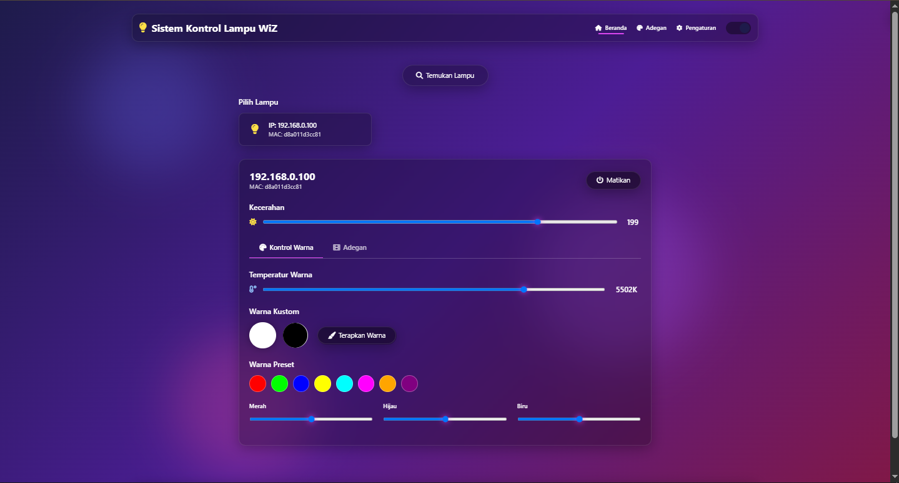

# 💡 WizLight Controller API - Pakai Flask, Bisa Atur Lampu Pintar!



Halo! Ini adalah project Python kecil-kecilan yang bisa kamu pakai buat **kontrol lampu WiZ** (smart bulb) lewat **API berbasis Flask**. Mulai dari nyalain, matiin, ubah warna, ubah kecerahan, sampai ubah scene, semua bisa lewat endpoint HTTP. Cocok buat ngoprek IoT-an di rumah 😎

---

## 🔧 Teknologi yang Dipakai
- Python 3.x
- Flask (buat REST API-nya)
- pywizlight (library buat ngatur lampu WiZ)
- socket & ipaddress (buat cari alamat broadcast lokal)
- Flask-CORS (supaya bisa diakses dari web lain)

---

## 🚀 Cara Menjalankan

1. **Install dulu semua kebutuhan**

   ```bash
   pip install flask flask-cors pywizlight 'flask[async]'
   ```

2. **Jalankan aplikasinya**

   ```bash
   python main.py
   ```

   Aplikasi akan berjalan di `http://localhost:5000`

---

## 🔌 Endpoint API

### 🔍 Cek apakah API aktif
`GET /api`  
Respons:
```json
{ "pesan": "Hello, World!" }
```

---

### 🔦 Cari lampu yang tersedia
`GET /api/lights/discover`  
Mendeteksi lampu WiZ di jaringan lokal.

---

### 🔎 Cek status lampu
`GET /api/lights/<ip>/state`  
Contoh:  
```
GET /api/lights/192.168.1.50/state
```

---

### 📴 Matikan lampu
`GET /api/lights/<ip>/off`

---

### 💡 Hidupkan lampu
`GET /api/lights/<ip>/on`

---

### 🌞 Atur tingkat kecerahan
`GET /api/lights/<ip>/brightness/<brightness>`  
- `brightness`: nilai dari 0 - 255  
Contoh:
```
GET /api/lights/192.168.1.50/brightness/150
```

---

### 🌡️ Atur suhu warna
`GET /api/lights/<ip>/colortemp/<colortemp>`  
- `colortemp`: nilai dari 2220 - 6500  
Contoh:
```
GET /api/lights/192.168.1.50/colortemp/4000
```

---

### 🌈 Atur warna RGB dan kecerahan  
`GET /api/lights/<ip>/color?red=...&green=...&blue=...&brightness=...`

- `red`, `green`, `blue`: nilai 0–255 (wajib)  
- `brightness`: nilai 0–255 (opsional, jika tidak diset maka pakai brightness terakhir)

Contoh:
```
GET /api/lights/192.168.1.50/color?red=255&green=100&blue=50&brightness=200
```

---

### 🎭 Atur scene  
`GET /api/lights/<ip>/scene/<scene_id>?speed=...&brightness=...`

- `scene_id`: ID scene dari daftar scene  
- `speed`: kecepatan scene (opsional)  
- `brightness`: kecerahan scene (opsional)  

Jika `speed` atau `brightness` tidak diisi, maka akan pakai nilai yang sedang aktif di lampu.

Contoh:
```
GET /api/lights/192.168.1.50/scene/4?speed=50&brightness=200
```

---

### 🎞 List scene
`GET /api/lights/scenes`  
Mengembalikan daftar semua scene yang tersedia.

---

## ⚠️ Catatan
- Lampu harus **terhubung ke jaringan lokal yang sama** dengan server ini.
- Beberapa fitur bisa berbeda tergantung model lampu WiZ yang kamu pakai.
- Gunakan IP lokal lampu (misalnya `192.168.1.xxx`).

---

## 👨‍💻 Cocok Buat Apa?
- Automasi rumah
- Proyek IoT
- Kontrol lampu dari web/app buatan sendiri
- Kontrol lampu lewat bot Telegram/WhatsApp
- Tugas kuliah 😄

---

Selamat ngoprek! 🚀
